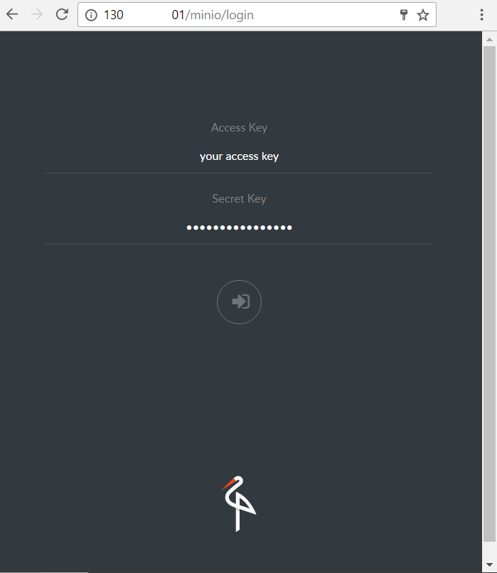

# Make Minio and NGINX get along
The purpose of this post is to install and configure Minio behind an Nginx HTTP server.

## Definitions
**Minio** is a hosted cloud storage service. It's been written with GO and distributed as a single binary file for Linux, Mac OS and Windows. It can be used to store very large objects (up to 5TB).
It's Amazon S3 compatible, it has a very minimal design and a smooth learning curve.
Out of the box, it offers authentication and access from browser.
More info about it can be found [here](https://minio.io/). 

**Nginx** is much more than an HTTP server, but for the purpose of this post, let's stick with that. 
Check [this](https://nginx.org/en/) to know more about it.  Just to throw in some numbers, almost 30% of websites and web apps make use of Nginx.

## Install Nginx
Installing Nginx is pretty straightforward. On a debian/ubuntu machine it goes
```bash
$ sudo apt-get update
$ sudo apt-get install nginx
```
Nginx is how installed and it will start automatically.

## Install Minio
Copy the following script to `/var/www/minio/install_minio.sh` and change its permission to be executable with `chmod +x /var/www/install_minio.sh`.
```bash
#!/bin/bash

CONFIG_DIR=/var/www/minio/config
DATA_DIR=/var/www/minio/data

echo "Downloading Minio"
wget https://dl.minio.io/server/minio/release/linux-amd64/minio

echo "Changing Minio permissions +x"
chmod +x minio

echo "Registering Minio somewhere in PATH"
ln -s /var/www/minio/minio /usr/bin/minio

echo "Creating config dir"
mkdir $CONFIG_DIR

echo "Creating data folder"
mkdir $DATA_DIR
```
## Configure Minio
Create the following conf file in `/var/www/minio/config/minio.env`
```bash
export MINIO_ACCESS_KEY=YourUserName
export MINIO_SECRET_KEY=YourPassword
export DATA_PATH=/var/www/minio/data
export CONFIG_PATH=/var/www/minio/config
export MINIO_HOST=127.0.0.1
export MINIO_PORT=9000
```
## Run Minio
Create an helper script in `/var/www/minio/run_minio.sh` to run minio on this machine, make sure to make it executable by  `chmod +x /var/www/minio/run_minio.sh`.
(It might be needed to reload your .bashrc by `source ~/.bashrc` so that minio is in your path)
```bash
#!/bin/bash

source config/minio.env

echo "Launching minio on $DATA_PATH at $MINIO_HOST:$MINIO_PORT"

minio server --address $MINIO_HOST:$MINIO_PORT -C $CONFIG_PATH $DATA_PATH
```
Just run `./run_minio.sh`

## What you should see
```
Launching minio on /var/www/minio/data at 127.0.0.1:9000

Endpoint:  http://127.0.0.1:9000
AccessKey: YourUserName 
SecretKey: YourPassword 
Region:    us-east-1
SQS ARNs:  <none>

Browser Access:
   http://127.0.0.1:9000

Command-line Access: https://docs.minio.io/docs/minio-client-quickstart-guide
   $ mc config host add myminio http://127.0.0.1:9000 YourUserName YourPassword

Object API (Amazon S3 compatible):
   Go:         https://docs.minio.io/docs/golang-client-quickstart-guide
   Java:       https://docs.minio.io/docs/java-client-quickstart-guide
   Python:     https://docs.minio.io/docs/python-client-quickstart-guide
   JavaScript: https://docs.minio.io/docs/javascript-client-quickstart-guide
Drive Capacity: 25 GiB Free, 29 GiB Total
```

## Configure Nginx
As it is, Minio is only available on this machine: to make it work for outer connections it's necessary to tell Nginx to wire it up on port 80.
At `/etc/nginx/sites-available/default` should be configured the default site, back up this file and replace it with the following snippet.
```nginx
server {
        listen 80;
        server_name _;
 
        location / {
            proxy_set_header HOST $http_host;
            proxy_pass http://localhost:9000;
        }
}
```

## Reload Nginx
To make the changes effective, Ngnix must be reloaded and it goes like this
```bash
$ sudo service nginx restart
```
## Conclusion
Minio is up and running, Nginx is happy to serve it, and everything can be checked by pointing a browser to `http://$YOUR_IP`. 

This is what should appear
